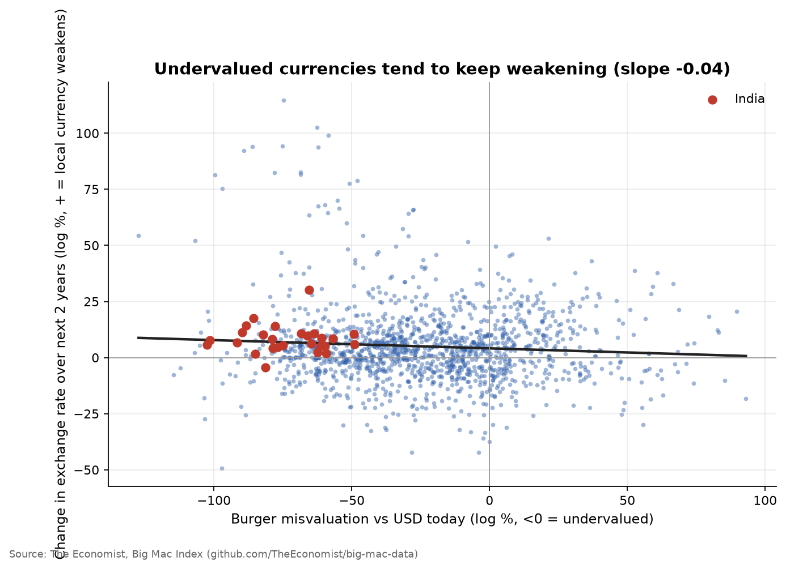
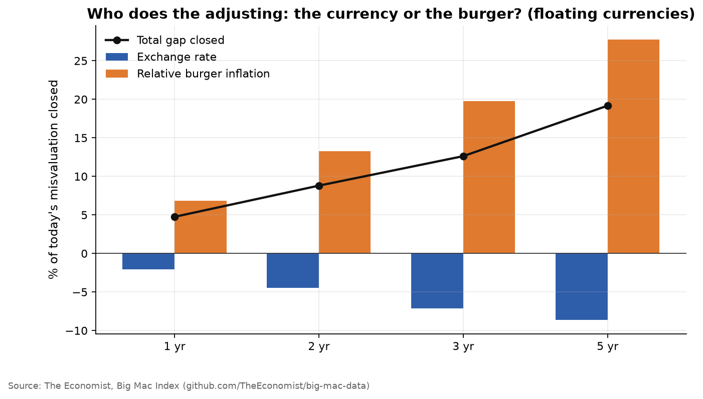
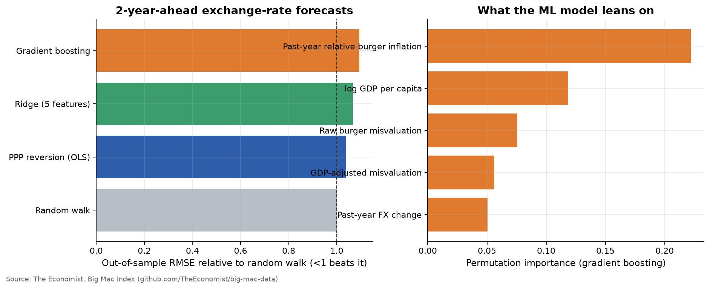
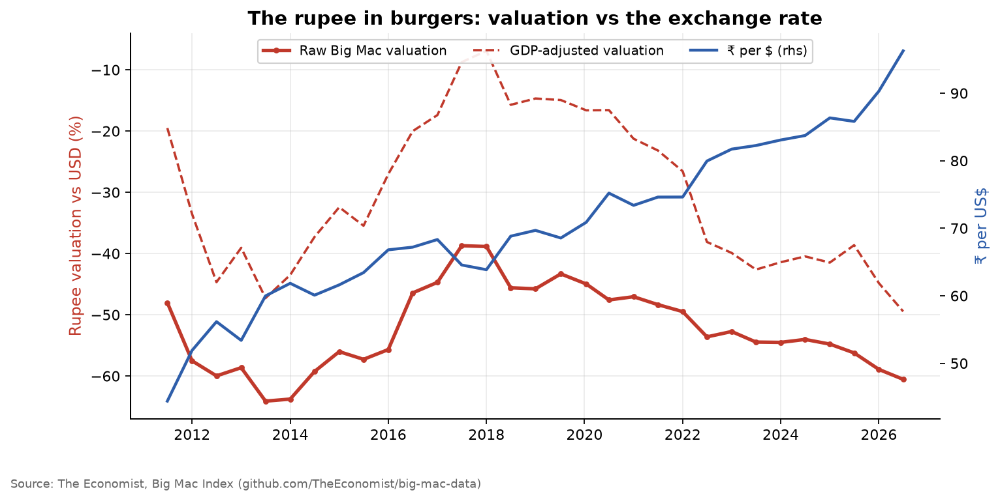

# Burgernomics: Does the Big Mac Index Predict Exchange Rates?

Since 1986 *The Economist* has used the price of a Big Mac as a rough test of purchasing power parity (PPP), the idea that exchange rates should adjust so the same basket costs the same everywhere. By that measure, a burger costing $2.50 in India against $6 in the US says the rupee is undervalued by about 60%.

**The question here is whether that misvaluation predicts anything.** If a currency looks cheap in burgers:
1. Does the gap close over time, and how fast?
2. **Who does the adjusting?** The gap can close through the currency strengthening or through local burger prices rising faster than US ones.
3. Can a model, including machine learning, turn burger misvaluation into exchange-rate forecasts that beat a random walk? Beating a random walk is the benchmark that has embarrassed exchange-rate models since Meese & Rogoff (1983).

## Data
[The Economist's Big Mac Index](https://github.com/TheEconomist/big-mac-data), full index, 2000 to latest. It covers 50+ currencies with local prices, exchange rates and a GDP-adjusted valuation. Argentina, Venezuela and Lebanon are excluded (hyperinflation or currency collapse). Currency redenominations are removed. Hard pegs (HKD, Gulf currencies, DKK) are analysed separately, because their exchange rate cannot adjust by construction.

## Method
**Misvaluation.** `v = ln(Big Mac price in $ / US Big Mac price)`. Negative means undervalued.

**Decomposing the adjustment.** Over horizon *h*, the change in misvaluation splits exactly into
`Δv = Δ ln(relative burger price) − Δ ln(exchange rate)`.
Regressing each piece on today's `v` (with release-date fixed effects to absorb global dollar swings, SEs clustered by currency) shows how much of the gap closes and **through which channel**.

**Forecasting contest.** Two-year-ahead exchange-rate forecasts, made in real time: at each release date, models are trained only on outcomes that had already been observed.

| Model | Inputs |
|---|---|
| Random walk | none (forecasts no change) |
| PPP reversion | burger misvaluation |
| Ridge | raw and GDP-adjusted misvaluation, income, past FX change, past burger inflation (standardised) |
| Gradient boosting | same five features; permutation importance shows what it uses |

## Results
<!-- RESULTS:START -->
_Auto-generated by `run.py` on 2026-09-25. Numbers refresh whenever the pipeline re-runs._

### Headline numbers

- Over 2 years, floating currencies close **9%** of their burger misvaluation. Exchange-rate moves contribute **-4 pp** and relative burger inflation **+13 pp** (negative = that channel widens the gap).
- Implied half-life of a misvaluation: **14.2 years**.
- Best out-of-sample model: **PPP reversion (OLS)**, RMSE **1.04×** the random walk (direction right 51% of the time). 991 forecasts from 29 origins.
- India (Jul 2026): the Big Mac puts the rupee at **-61%** vs the dollar (**-49%** after adjusting for income).

### Mean reversion by horizon (time fixed effects, SEs clustered by country)

| Group | h (yrs) | Closure of gap (−β on Δv) | via exchange rate | via burger prices | p (Δv) | Obs |
|---|---|---|---|---|---|---|
| Floaters | 1 | 0.05 | -0.02 | 0.07 | 0.00 | 1503 |
| Pegs | 1 | 0.10 | -0.00 | 0.11 | 0.13 | 226 |
| Floaters | 2 | 0.09 | -0.04 | 0.13 | 0.00 | 1426 |
| Pegs | 2 | 0.13 | 0.00 | 0.13 | 0.06 | 210 |
| Floaters | 3 | 0.13 | -0.07 | 0.20 | 0.00 | 1372 |
| Pegs | 3 | 0.15 | -0.00 | 0.15 | 0.04 | 196 |
| Floaters | 5 | 0.19 | -0.09 | 0.28 | 0.00 | 1198 |
| Pegs | 5 | 0.20 | 0.01 | 0.19 | 0.02 | 161 |

### Forecast horse race

| Model | RMSE (log pts) | RMSE vs random walk | Direction hit rate |
|---|---|---|---|
| Random walk | 0.179 | 1.000 | – |
| PPP reversion (OLS) | 0.186 | 1.039 | 0.507 |
| Ridge (5 features) | 0.191 | 1.067 | 0.473 |
| Gradient boosting | 0.196 | 1.094 | 0.520 |

### Figures

**Misvaluation vs subsequent FX change**



**Who adjusts**



**Forecast horse race**



**India**



<!-- RESULTS:END -->

### What it means
- **Burger gaps do close, but slowly, and the burger closes them rather than the currency.** Undervalued floating currencies tend to *keep weakening* (the exchange-rate channel has the wrong sign). The gap narrows only because burger prices in those countries rise faster than in the US. Pegged currencies close gaps at a similar speed, entirely through prices, as they must.
- **Burger undervaluation is not a trading signal.** No model beats the random walk out of sample, including gradient boosting with five features. Meese-Rogoff still holds with burgers.
- **The rupee is a textbook case.** It has looked 40–65% undervalued for the whole sample and has depreciated steadily anyway. Much of the "undervaluation" is the Balassa-Samuelson effect: non-traded inputs such as labour and rent are cheap in poorer countries, which the GDP-adjusted index partly corrects for.

## Reproduce
```bash
pip install -r requirements.txt
python run.py
```
A GitHub Action re-runs the pipeline on every push and monthly, so the results update when *The Economist* publishes a new index (January and July).

## Limitations
- A Big Mac is a basket of one: local beef and chicken prices, taxes and McDonald's pricing strategy all add noise. India's burger is a chicken Maharaja Mac, not beef.
- Releases are semi-annual and irregular before 2011, so horizons are matched to the nearest release within 75 days.
- Around 1,000 forecasts from 29 origins is a small sample for ML. Gradient boosting's failure here is informative, but not the last word.

## References
- Meese, R. & Rogoff, K. (1983). *Empirical exchange rate models of the seventies.* Journal of International Economics.
- Rogoff, K. (1996). *The purchasing power parity puzzle.* Journal of Economic Literature.
- Clements, K., Lan, Y. & Seah, S. (2012). *The Big Mac Index two decades on.* Applied Economics.
